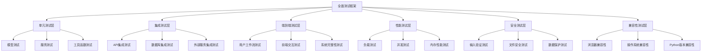

# 股票交易记录系统全面测试设计文档

## 概述

本文档基于需求文档，设计了一个全面的测试框架，用于验证股票交易记录和复盘系统的功能完整性、数据一致性、边界条件处理、性能表现、安全性、兼容性、用户体验以及数据迁移能力。

## 测试架构

### 测试层次结构



### 测试环境配置

#### 测试数据库配置
- 使用SQLite内存数据库进行快速测试
- 使用临时文件数据库进行持久化测试
- 支持测试数据的自动清理和重置

#### 测试客户端配置
- Flask测试客户端用于API测试
- Selenium WebDriver用于前端测试
- 并发测试工具用于性能测试

## 组件设计

### 1. 功能完整性测试组件

#### 1.1 API功能测试
**目标：** 验证所有API端点的基本功能

**测试覆盖：**
- 交易记录CRUD操作
- 复盘记录管理
- 股票池管理
- 案例研究管理
- 统计分析功能
- 价格服务功能
- 板块分析功能
- 策略管理功能

**测试方法：**
```python
class APIFunctionalityTester:
    def test_trading_api_complete_workflow(self):
        # 测试完整的交易API工作流程
        pass
    
    def test_review_api_complete_workflow(self):
        # 测试完整的复盘API工作流程
        pass
    
    def test_stock_pool_api_complete_workflow(self):
        # 测试完整的股票池API工作流程
        pass
```

#### 1.2 前端功能测试
**目标：** 验证前端页面的功能完整性

**测试覆盖：**
- 页面加载和渲染
- 表单提交和验证
- 数据展示和交互
- 图表生成和显示
- 文件上传功能

### 2. 数据完整性和一致性测试组件

#### 2.1 数据库约束测试
**目标：** 验证数据库约束和关系的正确性

**测试设计：**
```python
class DataIntegrityTester:
    def test_foreign_key_constraints(self):
        # 测试外键约束
        pass
    
    def test_unique_constraints(self):
        # 测试唯一性约束
        pass
    
    def test_cascade_operations(self):
        # 测试级联操作
        pass
```

#### 2.2 并发数据操作测试
**目标：** 验证并发访问时的数据一致性

**测试方法：**
- 多线程同时修改同一记录
- 并发创建相关联的记录
- 事务隔离级别验证

### 3. 边界条件和异常处理测试组件

#### 3.1 输入验证测试
**目标：** 验证系统对各种边界输入的处理

**测试场景：**
- 空值和null值处理
- 超长字符串输入
- 特殊字符和SQL注入尝试
- 数值边界值测试
- 日期格式验证

#### 3.2 资源限制测试
**目标：** 验证系统在资源受限情况下的行为

**测试设计：**
```python
class BoundaryConditionTester:
    def test_large_file_upload(self):
        # 测试大文件上传处理
        pass
    
    def test_database_storage_limits(self):
        # 测试数据库存储限制
        pass
    
    def test_memory_usage_limits(self):
        # 测试内存使用限制
        pass
```

### 4. 性能和负载测试组件

#### 4.1 响应时间测试
**目标：** 验证系统响应时间符合预期

**性能指标：**
- API响应时间 < 2秒
- 页面加载时间 < 3秒
- 数据库查询时间 < 1秒
- 文件上传处理时间 < 5秒

#### 4.2 并发负载测试
**目标：** 验证系统在高并发下的性能

**测试设计：**
```python
class PerformanceTester:
    def test_concurrent_api_requests(self):
        # 测试并发API请求
        with ThreadPoolExecutor(max_workers=20) as executor:
            futures = [executor.submit(self.api_request) for _ in range(100)]
            results = [future.result() for future in futures]
        
    def test_large_dataset_performance(self):
        # 测试大数据集性能
        pass
```

#### 4.3 内存和资源使用测试
**目标：** 验证系统资源使用的合理性

**监控指标：**
- 内存使用增长趋势
- 数据库连接池使用情况
- 文件句柄使用情况
- CPU使用率

### 5. 安全性测试组件

#### 5.1 输入安全测试
**目标：** 验证系统对恶意输入的防护

**测试场景：**
```python
class SecurityTester:
    def test_sql_injection_prevention(self):
        # 测试SQL注入防护
        malicious_inputs = [
            "'; DROP TABLE trades; --",
            "1' OR '1'='1",
            "UNION SELECT * FROM users"
        ]
        for input_data in malicious_inputs:
            self.verify_input_sanitization(input_data)
    
    def test_xss_prevention(self):
        # 测试XSS防护
        pass
    
    def test_file_upload_security(self):
        # 测试文件上传安全性
        pass
```

#### 5.2 数据保护测试
**目标：** 验证敏感数据的保护机制

**测试内容：**
- 日志中敏感信息过滤
- 错误信息中敏感数据隐藏
- 数据传输安全性

### 6. 兼容性测试组件

#### 6.1 浏览器兼容性测试
**目标：** 验证前端在不同浏览器中的兼容性

**测试浏览器：**
- Chrome (最新版本)
- Firefox (最新版本)
- Safari (最新版本)
- Edge (最新版本)

#### 6.2 操作系统兼容性测试
**目标：** 验证系统在不同操作系统上的运行

**测试平台：**
- Windows 10/11
- macOS (最新版本)
- Ubuntu Linux (LTS版本)

### 7. 用户体验测试组件

#### 7.1 界面响应性测试
**目标：** 验证用户界面的响应性和易用性

**测试设计：**
```python
class UXTester:
    def test_loading_states(self):
        # 测试加载状态显示
        pass
    
    def test_error_message_clarity(self):
        # 测试错误信息的清晰度
        pass
    
    def test_form_validation_feedback(self):
        # 测试表单验证反馈
        pass
```

#### 7.2 移动端适配测试
**目标：** 验证移动设备上的用户体验

**测试场景：**
- 不同屏幕尺寸适配
- 触摸操作响应
- 移动端性能表现

### 8. 数据迁移和版本兼容性测试组件

#### 8.1 数据迁移测试
**目标：** 验证数据库迁移的正确性

**测试流程：**
```python
class MigrationTester:
    def test_schema_migration(self):
        # 测试数据库结构迁移
        pass
    
    def test_data_migration_integrity(self):
        # 测试数据迁移完整性
        pass
    
    def test_rollback_capability(self):
        # 测试回滚能力
        pass
```

#### 8.2 版本兼容性测试
**目标：** 验证不同版本间的兼容性

**测试内容：**
- 数据格式兼容性
- API接口兼容性
- 配置文件兼容性

## 测试数据管理

### 测试数据生成策略

#### 1. 基础测试数据
```python
class TestDataGenerator:
    def generate_trade_records(self, count=100):
        # 生成交易记录测试数据
        pass
    
    def generate_review_records(self, count=50):
        # 生成复盘记录测试数据
        pass
    
    def generate_stock_pool_data(self, count=30):
        # 生成股票池测试数据
        pass
```

#### 2. 边界测试数据
- 最大值和最小值数据
- 特殊字符和格式数据
- 空值和异常数据

#### 3. 性能测试数据
- 大量记录数据集
- 复杂关联关系数据
- 历史数据模拟

### 测试数据清理策略

#### 自动清理机制
```python
@pytest.fixture(autouse=True)
def cleanup_test_data(db_session):
    yield
    # 测试后自动清理数据
    for table in reversed(db.metadata.sorted_tables):
        db_session.execute(table.delete())
    db_session.commit()
```

## 测试执行策略

### 测试分类和优先级

#### 1. 冒烟测试 (P0)
- 基本功能验证
- 系统启动测试
- 关键API可用性

#### 2. 核心功能测试 (P1)
- 完整业务流程测试
- 数据一致性测试
- 基本性能测试

#### 3. 扩展功能测试 (P2)
- 边界条件测试
- 兼容性测试
- 高级性能测试

#### 4. 增强测试 (P3)
- 压力测试
- 安全渗透测试
- 长期稳定性测试

### 测试执行顺序


## 测试报告和监控

### 测试结果收集

#### 1. 测试覆盖率统计
- 代码覆盖率
- 功能覆盖率
- API覆盖率

#### 2. 性能指标收集
- 响应时间统计
- 资源使用情况
- 并发处理能力

#### 3. 错误和异常统计
- 错误类型分布
- 异常处理效果
- 系统稳定性指标

### 测试报告生成

#### 综合测试报告结构
```
1. 测试执行摘要
2. 功能测试结果
3. 性能测试结果
4. 安全测试结果
5. 兼容性测试结果
6. 问题和建议
7. 测试数据附录
```

## 持续集成和自动化

### CI/CD集成

#### 自动化测试触发
- 代码提交触发
- 定时执行
- 手动触发

#### 测试环境管理
- 测试环境自动部署
- 测试数据自动准备
- 测试结果自动收集

### 测试维护策略

#### 1. 测试用例维护
- 定期更新测试用例
- 新功能测试用例添加
- 过时测试用例清理

#### 2. 测试数据维护
- 测试数据定期更新
- 敏感数据脱敏处理
- 测试数据版本管理

## 风险评估和缓解

### 测试风险识别

#### 1. 技术风险
- 测试环境不稳定
- 测试数据不完整
- 测试工具限制

#### 2. 时间风险
- 测试执行时间过长
- 测试结果分析延迟
- 问题修复时间不足

### 风险缓解措施

#### 1. 技术缓解
- 多环境备份
- 自动化测试数据生成
- 测试工具多样化

#### 2. 流程缓解
- 并行测试执行
- 优先级测试策略
- 快速反馈机制

## 成功标准

### 功能完整性标准
- 所有核心功能测试通过率 ≥ 99%
- API接口测试通过率 = 100%
- 端到端流程测试通过率 ≥ 95%

### 性能标准
- API平均响应时间 ≤ 2秒
- 页面加载时间 ≤ 3秒
- 并发处理能力 ≥ 50个请求/秒
- 系统可用性 ≥ 99.5%

### 安全标准
- 无高危安全漏洞
- 输入验证覆盖率 = 100%
- 敏感数据保护率 = 100%

### 兼容性标准
- 主流浏览器兼容性 = 100%
- 目标操作系统兼容性 = 100%
- Python版本兼容性符合要求