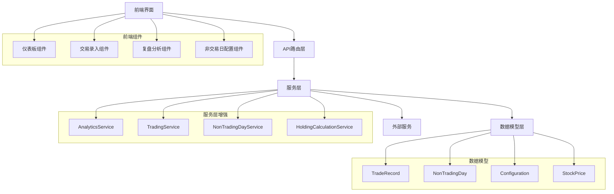
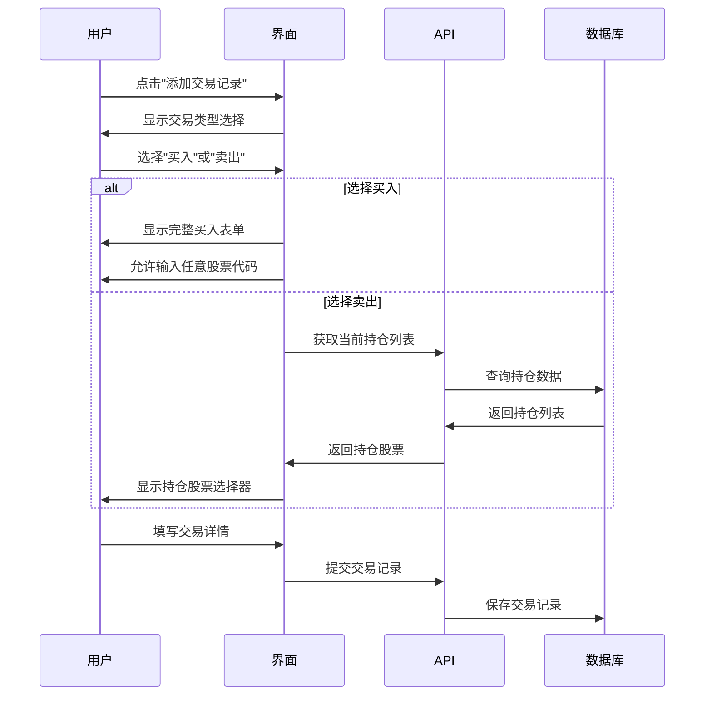

# 设计文档

## 概述

本设计文档详细描述了仪表板和交易功能增强的技术实现方案。该增强包括新的收益指标、灵活的交易规则、改进的用户界面流程、修复的百分比处理、以及非交易日配置功能。

## 架构

### 系统架构概述



## 组件和接口

### 1. 仪表板收益指标增强

#### 1.1 新增数据指标

**已清仓收益 (Realized Profit)**
- 计算所有已完成交易对（买入-卖出配对）的实际收益
- 单位：人民币元
- 显示位置：仪表板统计卡片

**当前持仓收益 (Current Holdings Profit)**
- 计算当前持仓的浮盈浮亏
- 公式：(当前价格 - 平均成本) × 持仓数量
- 单位：人民币元
- 显示位置：仪表板统计卡片

#### 1.2 AnalyticsService 增强

```python
class AnalyticsService:
    @classmethod
    def get_realized_profit(cls) -> float:
        """计算已清仓收益"""
        # 实现逻辑：
        # 1. 按股票代码分组所有交易记录
        # 2. 计算每只股票的持仓状态
        # 3. 对于持仓为0的股票，计算总收益
        pass
    
    @classmethod
    def get_current_holdings_profit(cls) -> float:
        """计算当前持仓收益"""
        # 实现逻辑：
        # 1. 获取所有当前持仓股票
        # 2. 获取最新价格
        # 3. 计算浮盈浮亏
        pass
```

### 2. 股票数量交易规则增强

#### 2.1 科创板股票识别

```python
def is_star_market_stock(stock_code: str) -> bool:
    """判断是否为科创板股票（68开头）"""
    return stock_code.startswith('68')

def validate_stock_quantity(stock_code: str, quantity: int) -> bool:
    """根据股票类型验证数量规则"""
    if is_star_market_stock(stock_code):
        return quantity > 0  # 科创板允许任意正整数
    else:
        return quantity > 0 and quantity % 100 == 0  # 其他股票必须100倍数
```

#### 2.2 前端验证逻辑

```javascript
class StockQuantityValidator {
    static validateQuantity(stockCode, quantity) {
        const isStarMarket = stockCode.startsWith('68');
        const qty = parseInt(quantity);
        
        if (isStarMarket) {
            return qty > 0;
        } else {
            return qty > 0 && qty % 100 === 0;
        }
    }
    
    static getQuantityHint(stockCode) {
        const isStarMarket = stockCode.startsWith('68');
        return isStarMarket 
            ? '科创板股票可购买任意数量' 
            : '股票数量必须是100的倍数';
    }
}
```

### 3. 交易类型选择工作流程

#### 3.1 交易录入流程重设计



#### 3.2 前端组件设计

```javascript
class TradeEntryModal {
    constructor() {
        this.tradeType = null;
        this.availableStocks = [];
    }
    
    showTradeTypeSelection() {
        // 显示买入/卖出选择界面
    }
    
    async selectTradeType(type) {
        this.tradeType = type;
        if (type === 'sell') {
            this.availableStocks = await this.loadCurrentHoldings();
            this.showStockSelector(this.availableStocks);
        } else {
            this.showStockInput();
        }
    }
    
    async loadCurrentHoldings() {
        // 从API获取当前持仓
    }
}
```

### 4. 止盈目标配置修复

#### 4.1 百分比处理逻辑

当前问题：系统将用户输入的数值直接作为小数处理，导致10%被理解为0.1而非10。

解决方案：
```python
class ProfitTargetValidator:
    @staticmethod
    def normalize_percentage_input(value: float, field_name: str) -> float:
        """标准化百分比输入"""
        if field_name in ['take_profit_ratio', 'sell_ratio']:
            # 如果用户输入的是百分比形式（如15表示15%）
            # 转换为小数形式（0.15）
            if value > 1:  # 假设大于1的值是百分比形式
                return value / 100
            return value
        return value
    
    @staticmethod
    def validate_profit_percentage(value: float) -> bool:
        """验证止盈百分比（允许大于10%）"""
        return 0 < value <= 10  # 最大1000%
    
    @staticmethod
    def validate_sell_percentage(value: float) -> bool:
        """验证卖出百分比（允许大于100%）"""
        return 0 < value <= 10  # 最大1000%
```

#### 4.2 前端显示增强

```javascript
class ProfitTargetDisplay {
    static formatPercentage(value) {
        // 确保显示时带有%符号
        return `${(value * 100).toFixed(2)}%`;
    }
    
    static parsePercentageInput(inputValue) {
        // 解析用户输入，支持带%和不带%的输入
        const numValue = parseFloat(inputValue.replace('%', ''));
        return numValue > 1 ? numValue / 100 : numValue;
    }
}
```

### 5. 月度收益率修复

#### 5.1 月度收益计算逻辑

```python
class MonthlyReturnCalculator:
    @classmethod
    def calculate_monthly_returns(cls, year: int) -> Dict[int, float]:
        """计算每月收益率"""
        monthly_returns = {}
        
        for month in range(1, 13):
            # 获取该月的所有已完成交易
            completed_trades = cls.get_completed_trades_by_month(year, month)
            
            if completed_trades:
                total_cost = sum(trade.total_cost for trade in completed_trades)
                total_revenue = sum(trade.total_revenue for trade in completed_trades)
                
                if total_cost > 0:
                    monthly_returns[month] = (total_revenue - total_cost) / total_cost
                else:
                    monthly_returns[month] = 0
            else:
                monthly_returns[month] = None  # 无数据
        
        return monthly_returns
```

### 6. 可配置收益分布分析

#### 6.1 收益区间配置模型

```python
class ProfitDistributionConfig(BaseModel):
    """收益分布配置模型"""
    __tablename__ = 'profit_distribution_configs'
    
    range_name = db.Column(db.String(50), nullable=False)
    min_profit_rate = db.Column(db.Numeric(5, 4))  # 最小收益率
    max_profit_rate = db.Column(db.Numeric(5, 4))  # 最大收益率
    sort_order = db.Column(db.Integer, default=0)
    is_active = db.Column(db.Boolean, default=True)
```

#### 6.2 交易配对逻辑

```python
class TradePairAnalyzer:
    @classmethod
    def analyze_completed_trades(cls) -> List[Dict]:
        """分析已完成的交易配对"""
        trades_by_stock = cls.group_trades_by_stock()
        completed_pairs = []
        
        for stock_code, trades in trades_by_stock.items():
            pairs = cls.extract_trade_pairs(trades)
            completed_pairs.extend(pairs)
        
        return completed_pairs
    
    @classmethod
    def extract_trade_pairs(cls, trades: List[TradeRecord]) -> List[Dict]:
        """从交易记录中提取买卖配对"""
        # 实现FIFO配对逻辑
        # 每个买入与后续卖出配对
        # 支持部分卖出的情况
        pass
```

### 7. 非交易日配置功能

#### 7.1 非交易日模型

```python
class NonTradingDay(BaseModel):
    """非交易日配置模型"""
    __tablename__ = 'non_trading_days'
    
    date = db.Column(db.Date, nullable=False, unique=True, index=True)
    name = db.Column(db.String(100))  # 节假日名称
    type = db.Column(db.String(20), default='holiday')  # holiday, weekend, other
    description = db.Column(db.Text)
    
    @classmethod
    def is_trading_day(cls, check_date: date) -> bool:
        """判断是否为交易日"""
        # 周六周日自动为非交易日
        if check_date.weekday() >= 5:  # 5=Saturday, 6=Sunday
            return False
        
        # 检查是否在配置的非交易日中
        non_trading = cls.query.filter_by(date=check_date).first()
        return non_trading is None
    
    @classmethod
    def calculate_trading_days(cls, start_date: date, end_date: date) -> int:
        """计算两个日期之间的交易日数量"""
        current_date = start_date
        trading_days = 0
        
        while current_date <= end_date:
            if cls.is_trading_day(current_date):
                trading_days += 1
            current_date += timedelta(days=1)
        
        return trading_days
```

#### 7.2 持仓天数计算增强

```python
class HoldingPeriodCalculator:
    @classmethod
    def calculate_holding_days(cls, buy_date: date, sell_date: date = None) -> int:
        """计算实际持仓交易日数"""
        end_date = sell_date or date.today()
        return NonTradingDay.calculate_trading_days(buy_date, end_date)
    
    @classmethod
    def get_current_holdings_with_days(cls) -> List[Dict]:
        """获取当前持仓及持仓天数"""
        holdings = cls.get_current_holdings()
        
        for holding in holdings:
            # 计算最早买入日期
            earliest_buy = cls.get_earliest_buy_date(holding['stock_code'])
            if earliest_buy:
                holding['holding_days'] = cls.calculate_holding_days(earliest_buy)
            else:
                holding['holding_days'] = 0
        
        return holdings
```

## 数据模型

### 1. 现有模型增强

#### TradeRecord 模型增强
```python
class TradeRecord(BaseModel):
    # ... 现有字段 ...
    
    # 新增字段
    actual_holding_days = db.Column(db.Integer)  # 实际持仓交易日数
    
    def calculate_actual_holding_days(self):
        """计算实际持仓天数"""
        if self.trade_type == 'buy':
            # 查找对应的卖出记录或使用当前日期
            sell_record = self.find_corresponding_sell()
            end_date = sell_record.trade_date.date() if sell_record else date.today()
            self.actual_holding_days = NonTradingDay.calculate_trading_days(
                self.trade_date.date(), end_date
            )
```

### 2. 新增模型

#### 收益分布配置模型
```python
class ProfitDistributionConfig(BaseModel):
    __tablename__ = 'profit_distribution_configs'
    
    range_name = db.Column(db.String(50), nullable=False)
    min_profit_rate = db.Column(db.Numeric(5, 4))
    max_profit_rate = db.Column(db.Numeric(5, 4))
    sort_order = db.Column(db.Integer, default=0)
    is_active = db.Column(db.Boolean, default=True)
    created_by = db.Column(db.String(50))
```

## 错误处理

### 1. 数据验证错误
- 股票代码格式验证
- 数量规则验证（区分科创板）
- 百分比范围验证
- 日期有效性验证

### 2. 业务逻辑错误
- 卖出时持仓不足
- 非交易日配置冲突
- 收益计算异常

### 3. 系统错误
- 数据库连接失败
- 外部价格服务不可用
- 文件系统错误

## 测试策略

### 1. 单元测试
- 各个服务类的方法测试
- 数据模型验证测试
- 工具函数测试

### 2. 集成测试
- API端点测试
- 数据库操作测试
- 前后端集成测试

### 3. 用户界面测试
- 交易录入流程测试
- 数据显示准确性测试
- 响应式设计测试

### 4. 性能测试
- 大量数据下的查询性能
- 复杂计算的执行时间
- 并发访问测试