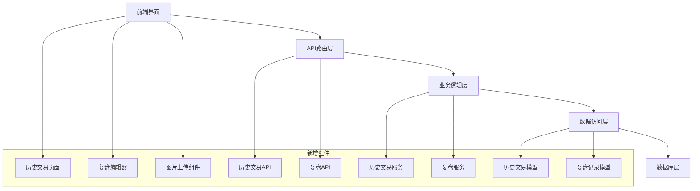
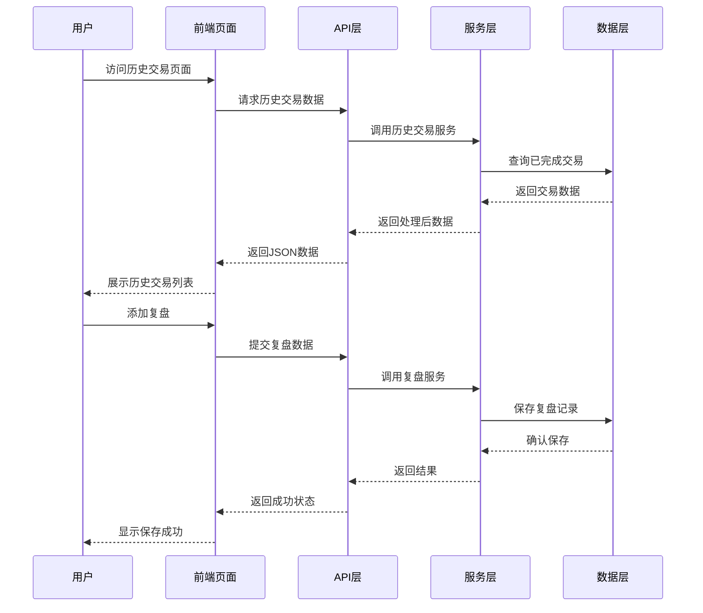

# 历史交易记录功能设计文档

## 概述

历史交易记录功能是一个全新的模块，用于展示已完成的交易记录并提供复盘功能。该功能将通过新建数据表来存储相关数据，确保不影响现有系统的表结构和数据。

## 架构

### 系统架构图



### 数据流架构



## 组件和接口

### 1. 数据模型层

#### 1.1 历史交易记录模型 (HistoricalTrade)

```python
class HistoricalTrade(BaseModel):
    """历史交易记录模型 - 存储已完成的完整交易"""
    
    __tablename__ = 'historical_trades'
    
    # 基本信息
    stock_code = db.Column(db.String(10), nullable=False, index=True)
    stock_name = db.Column(db.String(50), nullable=False)
    
    # 交易周期信息
    buy_date = db.Column(db.DateTime, nullable=False)
    sell_date = db.Column(db.DateTime, nullable=False)
    holding_days = db.Column(db.Integer, nullable=False)
    
    # 财务数据
    total_investment = db.Column(db.Numeric(12, 2), nullable=False)  # 总投入本金
    total_return = db.Column(db.Numeric(12, 2), nullable=False)      # 总实际收益
    return_rate = db.Column(db.Numeric(8, 4), nullable=False)        # 实际收益率
    
    # 交易记录关联
    buy_records_ids = db.Column(db.Text)   # JSON格式存储买入记录ID列表
    sell_records_ids = db.Column(db.Text)  # JSON格式存储卖出记录ID列表
    
    # 状态标识
    is_completed = db.Column(db.Boolean, default=True, nullable=False)
    completion_date = db.Column(db.DateTime, nullable=False)
```

#### 1.2 交易复盘记录模型 (TradeReview)

```python
class TradeReview(BaseModel):
    """交易复盘记录模型"""
    
    __tablename__ = 'trade_reviews'
    
    # 关联历史交易
    historical_trade_id = db.Column(db.Integer, db.ForeignKey('historical_trades.id'), nullable=False)
    
    # 复盘内容
    review_title = db.Column(db.String(200))
    review_content = db.Column(db.Text)
    
    # 复盘分类
    review_type = db.Column(db.String(20), default='general')  # general, success, failure, lesson
    
    # 评分系统
    strategy_score = db.Column(db.Integer)      # 策略执行评分 1-5
    timing_score = db.Column(db.Integer)        # 时机把握评分 1-5
    risk_control_score = db.Column(db.Integer)  # 风险控制评分 1-5
    overall_score = db.Column(db.Integer)       # 总体评分 1-5
    
    # 关键学习点
    key_learnings = db.Column(db.Text)
    improvement_areas = db.Column(db.Text)
    
    # 关系定义
    historical_trade = db.relationship('HistoricalTrade', backref='reviews')
```

#### 1.3 复盘图片模型 (ReviewImage)

```python
class ReviewImage(BaseModel):
    """复盘图片模型"""
    
    __tablename__ = 'review_images'
    
    # 关联复盘记录
    trade_review_id = db.Column(db.Integer, db.ForeignKey('trade_reviews.id'), nullable=False)
    
    # 图片信息
    filename = db.Column(db.String(255), nullable=False)
    original_filename = db.Column(db.String(255), nullable=False)
    file_path = db.Column(db.String(500), nullable=False)
    file_size = db.Column(db.Integer)
    mime_type = db.Column(db.String(100))
    
    # 图片描述
    description = db.Column(db.Text)
    display_order = db.Column(db.Integer, default=0)
    
    # 关系定义
    trade_review = db.relationship('TradeReview', backref='images')
```

### 2. 服务层

#### 2.1 历史交易服务 (HistoricalTradeService)

```python
class HistoricalTradeService:
    """历史交易业务逻辑服务"""
    
    @staticmethod
    def identify_completed_trades():
        """识别已完成的交易"""
        
    @staticmethod
    def calculate_trade_metrics(buy_records, sell_records):
        """计算交易指标"""
        
    @staticmethod
    def create_historical_record(trade_data):
        """创建历史交易记录"""
        
    @staticmethod
    def get_historical_trades(filters=None, pagination=None):
        """获取历史交易列表"""
```

#### 2.2 复盘服务 (ReviewService)

```python
class ReviewService:
    """复盘业务逻辑服务"""
    
    @staticmethod
    def create_review(historical_trade_id, review_data):
        """创建复盘记录"""
        
    @staticmethod
    def update_review(review_id, review_data):
        """更新复盘记录"""
        
    @staticmethod
    def upload_review_images(review_id, files):
        """上传复盘图片"""
        
    @staticmethod
    def get_review_by_trade(historical_trade_id):
        """获取交易的复盘记录"""
```

### 3. API接口层

#### 3.1 历史交易API

```python
# GET /api/historical-trades
# 获取历史交易列表
{
    "page": 1,
    "per_page": 20,
    "filters": {
        "stock_code": "000001",
        "date_range": ["2024-01-01", "2024-12-31"],
        "return_rate_range": [0.05, 0.20]
    }
}

# GET /api/historical-trades/{id}
# 获取单个历史交易详情

# POST /api/historical-trades/sync
# 同步生成历史交易记录
```

#### 3.2 复盘API

```python
# GET /api/trade-reviews/{historical_trade_id}
# 获取交易复盘

# POST /api/trade-reviews
# 创建复盘记录

# PUT /api/trade-reviews/{id}
# 更新复盘记录

# POST /api/trade-reviews/{id}/images
# 上传复盘图片

# DELETE /api/trade-reviews/images/{image_id}
# 删除复盘图片
```

### 4. 前端组件

#### 4.1 历史交易页面组件

- **HistoricalTradesTable**: 历史交易列表表格
- **TradeMetricsCard**: 交易指标卡片
- **FilterPanel**: 筛选面板
- **PaginationComponent**: 分页组件

#### 4.2 复盘功能组件

- **ReviewEditor**: 复盘编辑器
- **ImageUploader**: 图片上传组件
- **ReviewViewer**: 复盘查看器
- **ScoreRating**: 评分组件

## 数据模型

### 数据库表设计

#### historical_trades 表

| 字段名 | 类型 | 约束 | 说明 |
|--------|------|------|------|
| id | INTEGER | PRIMARY KEY | 主键 |
| stock_code | VARCHAR(10) | NOT NULL, INDEX | 股票代码 |
| stock_name | VARCHAR(50) | NOT NULL | 股票名称 |
| buy_date | DATETIME | NOT NULL | 首次买入日期 |
| sell_date | DATETIME | NOT NULL | 最后卖出日期 |
| holding_days | INTEGER | NOT NULL | 持仓天数 |
| total_investment | DECIMAL(12,2) | NOT NULL | 总投入本金 |
| total_return | DECIMAL(12,2) | NOT NULL | 总实际收益 |
| return_rate | DECIMAL(8,4) | NOT NULL | 实际收益率 |
| buy_records_ids | TEXT | | 买入记录ID列表(JSON) |
| sell_records_ids | TEXT | | 卖出记录ID列表(JSON) |
| is_completed | BOOLEAN | DEFAULT TRUE | 是否已完成 |
| completion_date | DATETIME | NOT NULL | 完成日期 |
| created_at | DATETIME | NOT NULL | 创建时间 |
| updated_at | DATETIME | NOT NULL | 更新时间 |

#### trade_reviews 表

| 字段名 | 类型 | 约束 | 说明 |
|--------|------|------|------|
| id | INTEGER | PRIMARY KEY | 主键 |
| historical_trade_id | INTEGER | FK, NOT NULL | 历史交易ID |
| review_title | VARCHAR(200) | | 复盘标题 |
| review_content | TEXT | | 复盘内容 |
| review_type | VARCHAR(20) | DEFAULT 'general' | 复盘类型 |
| strategy_score | INTEGER | CHECK(1-5) | 策略执行评分 |
| timing_score | INTEGER | CHECK(1-5) | 时机把握评分 |
| risk_control_score | INTEGER | CHECK(1-5) | 风险控制评分 |
| overall_score | INTEGER | CHECK(1-5) | 总体评分 |
| key_learnings | TEXT | | 关键学习点 |
| improvement_areas | TEXT | | 改进领域 |
| created_at | DATETIME | NOT NULL | 创建时间 |
| updated_at | DATETIME | NOT NULL | 更新时间 |

#### review_images 表

| 字段名 | 类型 | 约束 | 说明 |
|--------|------|------|------|
| id | INTEGER | PRIMARY KEY | 主键 |
| trade_review_id | INTEGER | FK, NOT NULL | 复盘记录ID |
| filename | VARCHAR(255) | NOT NULL | 文件名 |
| original_filename | VARCHAR(255) | NOT NULL | 原始文件名 |
| file_path | VARCHAR(500) | NOT NULL | 文件路径 |
| file_size | INTEGER | | 文件大小 |
| mime_type | VARCHAR(100) | | MIME类型 |
| description | TEXT | | 图片描述 |
| display_order | INTEGER | DEFAULT 0 | 显示顺序 |
| created_at | DATETIME | NOT NULL | 创建时间 |
| updated_at | DATETIME | NOT NULL | 更新时间 |

## 错误处理

### 错误类型定义

1. **数据验证错误**: 输入数据格式或范围错误
2. **业务逻辑错误**: 违反业务规则
3. **文件上传错误**: 图片上传相关错误
4. **数据库错误**: 数据库操作失败
5. **权限错误**: 用户权限不足

### 错误处理策略

- 前端表单验证
- API层数据验证
- 服务层业务逻辑验证
- 统一错误响应格式
- 用户友好的错误提示

## 测试策略

### 单元测试

- 模型层测试：数据验证、关系映射
- 服务层测试：业务逻辑、数据处理
- API层测试：接口响应、错误处理

### 集成测试

- 数据库集成测试
- API端到端测试
- 文件上传功能测试

### 前端测试

- 组件单元测试
- 用户交互测试
- 响应式布局测试

### 性能测试

- 大量数据加载测试
- 图片上传性能测试
- 数据库查询优化测试

## 安全考虑

### 数据安全

- 输入数据验证和清理
- SQL注入防护
- XSS攻击防护

### 文件安全

- 文件类型验证
- 文件大小限制
- 安全的文件存储路径
- 文件访问权限控制

### 用户权限

- 用户身份验证
- 操作权限验证
- 数据访问控制

## 部署和维护

### 数据库迁移

- 创建新表的迁移脚本
- 数据完整性检查
- 回滚策略

### 监控和日志

- API调用监控
- 错误日志记录
- 性能指标监控

### 备份策略

- 定期数据备份
- 图片文件备份
- 灾难恢复计划