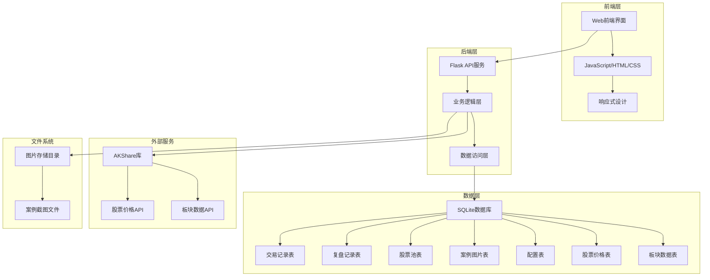

# Design Document

## Overview

股票交易记录和复盘系统采用前后端分离的架构设计，使用Python Flask作为后端API服务，SQLite作为数据存储，前端使用现代Web技术栈构建响应式用户界面。系统设计为单用户本地运行模式，数据通过Git进行版本控制和同步，为后续多用户扩展预留架构空间。

## Architecture

### 系统架构图



### 技术栈选择

**后端技术栈：**
- Python 3.8+ - 主要编程语言
- Flask - 轻量级Web框架，适合单用户应用
- SQLite - 嵌入式数据库，便于数据文件管理和Git同步
- AKShare - 股票数据获取库，用于获取股价和板块数据
- Pillow - 图片处理库，用于格式转换
- SQLAlchemy - ORM框架，简化数据库操作

**AKShare集成说明：**
- 股票价格获取：使用 `ak.stock_zh_a_spot_em()` 获取A股实时行情数据
- 板块数据获取：使用 `ak.stock_board_industry_name_em()` 获取行业板块涨跌幅排名
- 数据更新策略：手动触发更新，避免频繁API调用
- 数据去重：通过日期字段确保同一天数据不重复存储

**前端技术栈：**
- HTML5/CSS3/JavaScript - 基础Web技术
- Bootstrap 5 - 响应式UI框架
- Chart.js - 数据可视化图表库
- Axios - HTTP客户端库

## Components and Interfaces

### 后端API组件

#### 1. 交易记录管理 (Trading Records)

**API端点：**
- `GET /api/trades` - 获取交易记录列表
- `POST /api/trades` - 创建新交易记录
- `PUT /api/trades/{id}` - 更新交易记录
- `DELETE /api/trades/{id}` - 删除交易记录
- `POST /api/trades/calculate-risk-reward` - 计算止损止盈预期
- `POST /api/trades/{id}/correct` - 订正交易记录
- `GET /api/trades/{id}/history` - 获取交易记录修改历史

**核心计算逻辑：**
```python
class TradingCalculator:
    @staticmethod
    def calculate_expected_loss_ratio(buy_price: float, stop_loss_price: float) -> float:
        """计算预计亏损比例"""
        if stop_loss_price >= buy_price:
            return 0.0
        return (buy_price - stop_loss_price) / buy_price
    
    @staticmethod
    def calculate_expected_profit_ratio(buy_price: float, take_profit_ratio: float, sell_ratio: float) -> float:
        """计算预计收益率"""
        target_price = buy_price * (1 + take_profit_ratio)
        profit_per_share = target_price - buy_price
        return (profit_per_share * sell_ratio) / buy_price
    
    @staticmethod
    def calculate_risk_reward_ratio(expected_loss_ratio: float, expected_profit_ratio: float) -> float:
        """计算风险收益比"""
        if expected_loss_ratio == 0:
            return float('inf')
        return expected_profit_ratio / expected_loss_ratio

class TradeCorrectionService:
    def correct_trade_record(self, original_trade_id: int, corrected_data: dict, reason: str):
        """订正交易记录"""
        # 1. 获取原始记录
        original_trade = self.get_trade_by_id(original_trade_id)
        
        # 2. 标记原始记录为已订正
        original_trade.is_corrected = True
        self.update_trade(original_trade)
        
        # 3. 创建订正后的新记录
        corrected_trade = self.create_corrected_trade(original_trade, corrected_data)
        corrected_trade.original_record_id = original_trade_id
        corrected_trade.correction_reason = reason
        new_trade_id = self.save_trade(corrected_trade)
        
        # 4. 记录订正历史
        correction_record = TradeCorrection(
            original_trade_id=original_trade_id,
            corrected_trade_id=new_trade_id,
            correction_reason=reason,
            corrected_fields=json.dumps(self.get_changed_fields(original_trade, corrected_data))
        )
        self.save_correction(correction_record)
        
        return new_trade_id
    
    def get_correction_history(self, trade_id: int):
        """获取交易记录的订正历史"""
        return self.query_corrections_by_trade_id(trade_id)
    
    def get_changed_fields(self, original: TradeRecord, corrected_data: dict) -> dict:
        """比较并返回修改的字段"""
        changes = {}
        for field, new_value in corrected_data.items():
            original_value = getattr(original, field, None)
            if original_value != new_value:
                changes[field] = {
                    'old_value': original_value,
                    'new_value': new_value
                }
        return changes
```

**数据模型：**
```python
class TradeRecord:
    id: int
    stock_code: str
    stock_name: str
    trade_type: str  # 'buy' or 'sell'
    price: float
    quantity: int
    trade_date: datetime
    reason: str
    notes: str
    # 买入时的止损止盈设置
    stop_loss_price: float      # 止损价格
    take_profit_ratio: float    # 止盈比例 (如0.2表示20%)
    sell_ratio: float           # 卖出比例 (如0.5表示卖出50%仓位)
    # 自动计算字段
    expected_loss_ratio: float  # 预计亏损比例
    expected_profit_ratio: float # 预计收益率
    # 订正相关字段
    is_corrected: bool          # 是否被订正过
    original_record_id: int     # 原始记录ID (如果是订正记录)
    correction_reason: str      # 订正原因
    created_at: datetime

class TradeCorrection:
    id: int
    original_trade_id: int      # 原始交易记录ID
    corrected_trade_id: int     # 订正后的交易记录ID
    correction_reason: str      # 订正原因
    corrected_fields: str       # JSON格式记录修改的字段
    created_by: str             # 操作人 (预留字段)
    created_at: datetime
```

#### 2. 复盘记录管理 (Review Records)

**API端点：**
- `GET /api/reviews` - 获取复盘记录
- `POST /api/reviews` - 创建复盘记录
- `PUT /api/reviews/{id}` - 更新复盘记录
- `GET /api/holdings` - 获取当前持仓列表
- `GET /api/holdings/alerts` - 获取持仓策略提醒

**数据模型：**
```python
class ReviewRecord:
    id: int
    stock_code: str
    review_date: date
    price_up_score: int  # 收盘价上升 (0-1)
    bbi_score: int       # 不破BBI线 (0-1)
    volume_score: int    # 无放量阴线 (0-1)
    trend_score: int     # 趋势还在向上 (0-1)
    j_score: int         # J没死叉 (0-1)
    total_score: int     # 总分 (0-5)
    analysis: str
    decision: str        # 'hold', 'sell_all', 'sell_partial'
    reason: str
    holding_days: int    # 手动输入的持仓天数

class HoldingAlert:
    stock_code: str
    stock_name: str
    holding_days: int
    buy_price: float
    current_price: float
    profit_loss_ratio: float
    alert_type: str      # 'sell_all', 'sell_partial', 'hold'
    alert_message: str
    sell_ratio: float    # 建议卖出比例
    strategy_rule: str   # 触发的策略规则
```

#### 3. 股票池管理 (Stock Pool)

**API端点：**
- `GET /api/stock-pool` - 获取股票池列表
- `POST /api/stock-pool` - 添加股票到池中
- `PUT /api/stock-pool/{id}` - 更新股票池状态
- `DELETE /api/stock-pool/{id}` - 从池中移除股票

**数据模型：**
```python
class StockPool:
    id: int
    stock_code: str
    stock_name: str
    pool_type: str       # 'watch' or 'buy_ready'
    target_price: float
    add_reason: str
    status: str          # 'active', 'moved', 'removed'
    created_at: datetime
    updated_at: datetime
```

#### 4. 案例管理 (Case Studies)

**API端点：**
- `GET /api/cases` - 获取案例列表
- `POST /api/cases` - 上传新案例
- `PUT /api/cases/{id}` - 更新案例信息
- `DELETE /api/cases/{id}` - 删除案例

**数据模型：**
```python
class CaseStudy:
    id: int
    stock_code: str
    title: str
    image_path: str
    tags: str            # JSON格式存储标签数组
    notes: str
    created_at: datetime
```

#### 5. 统计分析 (Analytics)

**API端点：**
- `GET /api/analytics/overview` - 获取总体统计
- `GET /api/analytics/monthly` - 获取月度统计
- `GET /api/analytics/profit-distribution` - 获取收益分布
- `GET /api/analytics/export` - 导出统计数据

#### 6. 股票价格服务 (Price Service)

**API端点：**
- `POST /api/prices/refresh` - 手动刷新股票价格
- `GET /api/prices/{stock_code}` - 获取特定股票价格

#### 7. 持仓策略服务 (Holding Strategy)

**API端点：**
- `GET /api/strategies` - 获取策略配置列表
- `POST /api/strategies` - 创建新策略配置
- `PUT /api/strategies/{id}` - 更新策略配置
- `DELETE /api/strategies/{id}` - 删除策略配置
- `POST /api/strategies/evaluate` - 评估持仓策略提醒

**数据模型：**
```python
class TradingStrategy:
    id: int
    strategy_name: str      # 策略名称
    is_active: bool         # 是否启用
    rules: str              # JSON格式存储策略规则
    description: str        # 策略描述
    created_at: datetime

class StrategyRule:
    day_range_start: int    # 持仓天数范围开始
    day_range_end: int      # 持仓天数范围结束
    loss_threshold: float   # 亏损阈值 (负数)
    profit_threshold: float # 盈利阈值
    drawdown_threshold: float # 回撤阈值
    action: str             # 'sell_all', 'sell_partial', 'hold'
    sell_ratio: float       # 卖出比例 (0-1)
    condition: str          # 'and', 'or' - 多条件逻辑
```

**策略评估逻辑：**
```python
class StrategyEvaluator:
    def evaluate_holding(self, stock_code: str, holding_days: int, 
                        buy_price: float, current_price: float) -> HoldingAlert:
        """评估持仓并生成提醒"""
        profit_loss_ratio = (current_price - buy_price) / buy_price
        
        # 获取适用的策略规则
        applicable_rules = self.get_rules_for_holding_days(holding_days)
        
        for rule in applicable_rules:
            if self.rule_triggered(rule, profit_loss_ratio, holding_days):
                return HoldingAlert(
                    stock_code=stock_code,
                    holding_days=holding_days,
                    profit_loss_ratio=profit_loss_ratio,
                    alert_type=rule.action,
                    sell_ratio=rule.sell_ratio,
                    alert_message=self.generate_alert_message(rule, profit_loss_ratio),
                    strategy_rule=rule.description
                )
        
        return None  # 无提醒
    
    def rule_triggered(self, rule: StrategyRule, profit_loss_ratio: float, 
                      holding_days: int) -> bool:
        """判断策略规则是否触发"""
        # 实现具体的规则判断逻辑
        pass
```

#### 8. 板块分析服务 (Sector Analysis)

**API端点：**
- `POST /api/sectors/refresh` - 手动刷新板块数据
- `GET /api/sectors/ranking` - 获取板块涨幅排名
- `GET /api/sectors/history` - 获取历史板块表现
- `GET /api/sectors/top-performers` - 获取最近N天TOPK板块统计

**数据模型：**
```python
class SectorData:
    id: int
    sector_name: str        # 板块名称
    sector_code: str        # 板块代码
    change_percent: float   # 涨跌幅
    record_date: date       # 记录日期
    rank_position: int      # 当日排名位置
    volume: int             # 成交量
    market_cap: float       # 总市值
    created_at: datetime

class SectorRanking:
    id: int
    record_date: date       # 记录日期
    ranking_data: str       # JSON格式存储当日完整排名数据
    total_sectors: int      # 当日总板块数
    created_at: datetime

class TopSectorStats:
    sector_name: str        # 板块名称
    appearances: int        # 进入TOPK次数
    avg_rank: float         # 平均排名
    best_rank: int          # 最佳排名
    latest_rank: int        # 最新排名
    trend: str              # 趋势方向 ('up', 'down', 'stable')
```

**核心业务逻辑：**

```python
class SectorAnalysisService:
    def refresh_sector_data(self):
        """刷新板块数据，避免重复记录"""
        today = datetime.now().date()
        
        # 检查今日是否已有数据
        if self.has_data_for_date(today):
            return {"message": "今日数据已存在，无需重复获取"}
        
        # 获取AKShare板块数据
        sector_df = ak.stock_board_industry_name_em()
        
        # 批量插入数据
        for idx, row in sector_df.iterrows():
            sector_data = SectorData(
                sector_name=row['板块名称'],
                change_percent=row['涨跌幅'],
                record_date=today,
                rank_position=idx + 1,
                volume=row['成交量'],
                market_cap=row['总市值']
            )
            self.save_sector_data(sector_data)
    
    def get_top_performers(self, days: int, top_k: int):
        """获取最近N天TOPK板块统计"""
        end_date = datetime.now().date()
        start_date = end_date - timedelta(days=days)
        
        # 查询指定时间范围内排名前K的板块
        query = """
        SELECT sector_name, 
               COUNT(*) as appearances,
               AVG(rank_position) as avg_rank,
               MIN(rank_position) as best_rank,
               MAX(record_date) as latest_date
        FROM sector_data 
        WHERE record_date BETWEEN ? AND ? 
        AND rank_position <= ?
        GROUP BY sector_name
        ORDER BY appearances DESC, avg_rank ASC
        """
        
        return self.execute_query(query, [start_date, end_date, top_k])
```

### 前端组件架构

#### 1. 页面组件结构

```
src/
├── pages/
│   ├── dashboard.html          # 主仪表板
│   ├── trading-records.html    # 交易记录页面
│   ├── review.html            # 复盘页面
│   ├── stock-pool.html        # 股票池管理
│   ├── sector-analysis.html   # 板块分析页面
│   ├── cases.html             # 案例管理
│   └── analytics.html         # 统计分析
├── js/
│   ├── api.js                 # API调用封装
│   ├── components/            # 可复用组件
│   ├── utils.js               # 工具函数
│   └── main.js                # 主应用逻辑
├── css/
│   ├── main.css               # 主样式文件
│   └── components.css         # 组件样式
└── assets/
    └── images/                # 静态图片资源
```

#### 2. 核心JavaScript组件

**API客户端 (api.js):**
```javascript
class ApiClient {
    constructor(baseURL) {
        this.baseURL = baseURL;
        this.axios = axios.create({ baseURL });
    }
    
    // 交易记录相关API
    async getTrades(params) { /* ... */ }
    async createTrade(data) { /* ... */ }
    
    // 复盘记录相关API
    async getReviews(params) { /* ... */ }
    async createReview(data) { /* ... */ }
    
    // 板块分析相关API
    async getSectorRanking(params) { /* ... */ }
    async refreshSectorData() { /* ... */ }
    async getTopPerformingSectors(days, topK) { /* ... */ }
    
    // 交易记录订正相关API
    async correctTrade(tradeId, correctedData, reason) { /* ... */ }
    async getCorrectionHistory(tradeId) { /* ... */ }
    
    // 其他API方法...
}
```

**前端订正功能组件：**

```javascript
class TradeCorrectionModal {
    constructor(originalTrade) {
        this.originalTrade = originalTrade;
        this.correctedData = { ...originalTrade };
    }
    
    render() {
        return `
        <div class="correction-modal">
            <h3>订正交易记录</h3>
            <div class="original-data">
                <h4>原始数据：</h4>
                <p>股票代码: ${this.originalTrade.stock_code}</p>
                <p>价格: ${this.originalTrade.price}</p>
                <p>数量: ${this.originalTrade.quantity}</p>
                <!-- 显示其他原始字段 -->
            </div>
            <div class="correction-form">
                <h4>订正后数据：</h4>
                <input type="text" id="corrected-price" value="${this.originalTrade.price}">
                <input type="number" id="corrected-quantity" value="${this.originalTrade.quantity}">
                <!-- 其他可订正字段 -->
                <textarea id="correction-reason" placeholder="请输入订正原因"></textarea>
            </div>
            <div class="correction-actions">
                <button onclick="this.submitCorrection()">确认订正</button>
                <button onclick="this.cancel()">取消</button>
            </div>
        </div>
        `;
    }
    
    async submitCorrection() {
        const reason = document.getElementById('correction-reason').value;
        if (!reason.trim()) {
            alert('请输入订正原因');
            return;
        }
        
        const correctedData = this.getCorrectedData();
        await apiClient.correctTrade(this.originalTrade.id, correctedData, reason);
        this.close();
        // 刷新交易记录列表
        window.location.reload();
    }
}
```

## Data Models

### 数据库表设计

#### 1. 交易记录表 (trade_records)

```sql
CREATE TABLE trade_records (
    id INTEGER PRIMARY KEY AUTOINCREMENT,
    stock_code VARCHAR(10) NOT NULL,
    stock_name VARCHAR(50) NOT NULL,
    trade_type VARCHAR(10) NOT NULL CHECK (trade_type IN ('buy', 'sell')),
    price DECIMAL(10,2) NOT NULL,
    quantity INTEGER NOT NULL,
    trade_date DATETIME NOT NULL,
    reason VARCHAR(50) NOT NULL,
    notes TEXT,
    -- 止损止盈设置 (仅买入记录需要)
    stop_loss_price DECIMAL(10,2),
    take_profit_ratio DECIMAL(5,4),  -- 支持到万分位精度
    sell_ratio DECIMAL(5,4),         -- 支持到万分位精度
    -- 自动计算字段
    expected_loss_ratio DECIMAL(5,4),
    expected_profit_ratio DECIMAL(5,4),
    -- 订正相关字段
    is_corrected BOOLEAN DEFAULT 0,
    original_record_id INTEGER,
    correction_reason TEXT,
    created_at DATETIME DEFAULT CURRENT_TIMESTAMP,
    updated_at DATETIME DEFAULT CURRENT_TIMESTAMP,
    FOREIGN KEY (original_record_id) REFERENCES trade_records(id)
);
```

#### 10. 交易记录订正表 (trade_corrections)

```sql
CREATE TABLE trade_corrections (
    id INTEGER PRIMARY KEY AUTOINCREMENT,
    original_trade_id INTEGER NOT NULL,
    corrected_trade_id INTEGER NOT NULL,
    correction_reason TEXT NOT NULL,
    corrected_fields TEXT NOT NULL,  -- JSON格式记录修改的字段
    created_by VARCHAR(50) DEFAULT 'user',
    created_at DATETIME DEFAULT CURRENT_TIMESTAMP,
    FOREIGN KEY (original_trade_id) REFERENCES trade_records(id),
    FOREIGN KEY (corrected_trade_id) REFERENCES trade_records(id)
);

-- 创建索引
CREATE INDEX idx_corrections_original ON trade_corrections(original_trade_id);
CREATE INDEX idx_corrections_corrected ON trade_corrections(corrected_trade_id);
```

#### 2. 复盘记录表 (review_records)

```sql
CREATE TABLE review_records (
    id INTEGER PRIMARY KEY AUTOINCREMENT,
    stock_code VARCHAR(10) NOT NULL,
    review_date DATE NOT NULL,
    price_up_score INTEGER CHECK (price_up_score IN (0,1)),
    bbi_score INTEGER CHECK (bbi_score IN (0,1)),
    volume_score INTEGER CHECK (volume_score IN (0,1)),
    trend_score INTEGER CHECK (trend_score IN (0,1)),
    j_score INTEGER CHECK (j_score IN (0,1)),
    total_score INTEGER CHECK (total_score BETWEEN 0 AND 5),
    analysis TEXT,
    decision VARCHAR(20) CHECK (decision IN ('hold', 'sell_all', 'sell_partial')),
    reason TEXT,
    holding_days INTEGER,
    created_at DATETIME DEFAULT CURRENT_TIMESTAMP,
    UNIQUE(stock_code, review_date)
);
```

#### 3. 股票池表 (stock_pool)

```sql
CREATE TABLE stock_pool (
    id INTEGER PRIMARY KEY AUTOINCREMENT,
    stock_code VARCHAR(10) NOT NULL,
    stock_name VARCHAR(50) NOT NULL,
    pool_type VARCHAR(20) NOT NULL CHECK (pool_type IN ('watch', 'buy_ready')),
    target_price DECIMAL(10,2),
    add_reason TEXT,
    status VARCHAR(20) DEFAULT 'active' CHECK (status IN ('active', 'moved', 'removed')),
    created_at DATETIME DEFAULT CURRENT_TIMESTAMP,
    updated_at DATETIME DEFAULT CURRENT_TIMESTAMP
);
```

#### 4. 案例研究表 (case_studies)

```sql
CREATE TABLE case_studies (
    id INTEGER PRIMARY KEY AUTOINCREMENT,
    stock_code VARCHAR(10),
    title VARCHAR(100) NOT NULL,
    image_path VARCHAR(255) NOT NULL,
    tags TEXT, -- JSON格式存储标签
    notes TEXT,
    created_at DATETIME DEFAULT CURRENT_TIMESTAMP
);
```

#### 5. 配置表 (configurations)

```sql
CREATE TABLE configurations (
    id INTEGER PRIMARY KEY AUTOINCREMENT,
    config_key VARCHAR(50) UNIQUE NOT NULL,
    config_value TEXT NOT NULL,
    description TEXT,
    updated_at DATETIME DEFAULT CURRENT_TIMESTAMP
);

-- 初始化配置数据
INSERT INTO configurations (config_key, config_value, description) VALUES
('buy_reasons', '["少妇B1战法", "少妇SB1战法", "少妇B2战法", "单针二十战法"]', '买入原因选项'),
('sell_reasons', '["部分止盈", "止损", "下等马/草泥马"]', '卖出原因选项');
```

#### 6. 股票价格缓存表 (stock_prices)

```sql
CREATE TABLE stock_prices (
    id INTEGER PRIMARY KEY AUTOINCREMENT,
    stock_code VARCHAR(10) NOT NULL,
    stock_name VARCHAR(50),
    current_price DECIMAL(10,2),
    change_percent DECIMAL(5,2),
    record_date DATE NOT NULL,
    created_at DATETIME DEFAULT CURRENT_TIMESTAMP,
    UNIQUE(stock_code, record_date)  -- 防止同一股票同一天重复记录
);
```

#### 7. 板块数据表 (sector_data)

```sql
CREATE TABLE sector_data (
    id INTEGER PRIMARY KEY AUTOINCREMENT,
    sector_name VARCHAR(50) NOT NULL,
    sector_code VARCHAR(20),
    change_percent DECIMAL(5,2) NOT NULL,
    record_date DATE NOT NULL,
    rank_position INTEGER,
    volume BIGINT,
    market_cap DECIMAL(15,2),
    created_at DATETIME DEFAULT CURRENT_TIMESTAMP,
    UNIQUE(sector_name, record_date)  -- 防止同一板块同一天重复记录
);

-- 创建索引优化查询性能
CREATE INDEX idx_sector_date_rank ON sector_data(record_date, rank_position);
CREATE INDEX idx_sector_name_date ON sector_data(sector_name, record_date);
```

#### 8. 板块排名历史表 (sector_rankings)

```sql
CREATE TABLE sector_rankings (
    id INTEGER PRIMARY KEY AUTOINCREMENT,
    record_date DATE UNIQUE NOT NULL,
    ranking_data TEXT NOT NULL,  -- JSON格式存储完整排名数据
    total_sectors INTEGER,       -- 当日总板块数
    created_at DATETIME DEFAULT CURRENT_TIMESTAMP
);
```

#### 9. 交易策略表 (trading_strategies)

```sql
CREATE TABLE trading_strategies (
    id INTEGER PRIMARY KEY AUTOINCREMENT,
    strategy_name VARCHAR(100) NOT NULL,
    is_active BOOLEAN DEFAULT 1,
    rules TEXT NOT NULL,         -- JSON格式存储策略规则
    description TEXT,
    created_at DATETIME DEFAULT CURRENT_TIMESTAMP,
    updated_at DATETIME DEFAULT CURRENT_TIMESTAMP
);

-- 插入默认策略
INSERT INTO trading_strategies (strategy_name, rules, description) VALUES 
('默认持仓策略', '{
  "rules": [
    {"day_range": [1,1], "loss_threshold": -0.05, "action": "sell_all", "condition": "loss_exceed"},
    {"day_range": [2,4], "loss_threshold": -0.03, "action": "sell_all", "condition": "loss_exceed"},
    {"day_range": [5,5], "loss_threshold": -0.02, "action": "sell_all", "condition": "loss_exceed"},
    {"day_range": [6,6], "profit_threshold": 0.03, "action": "sell_all", "condition": "profit_below"},
    {"day_range": [7,10], "profit_threshold": 0.07, "action": "sell_all", "condition": "profit_below"},
    {"day_range": [7,10], "profit_threshold": 0.10, "action": "sell_partial", "sell_ratio": 0.3, "condition": "profit_exceed"},
    {"day_range": [11,15], "profit_threshold": 0.15, "drawdown_threshold": 0.10, "action": "sell_all", "condition": "profit_below_or_drawdown"},
    {"day_range": [11,15], "profit_threshold": 0.20, "action": "sell_partial", "sell_ratio": 0.3, "condition": "profit_exceed"},
    {"day_range": [16,20], "profit_threshold": 0.25, "drawdown_threshold": 0.15, "action": "sell_all", "condition": "profit_below_or_drawdown"},
    {"day_range": [16,20], "profit_threshold": 0.30, "action": "sell_partial", "sell_ratio": 0.2, "condition": "profit_exceed"},
    {"day_range": [21,30], "profit_threshold": 0.30, "drawdown_threshold": 0.15, "action": "sell_all", "condition": "profit_below_or_drawdown"}
  ]
}', '基于持仓天数的动态止损止盈策略');
```

## Error Handling

### 后端错误处理策略

#### 1. API错误响应格式

```python
{
    "success": false,
    "error": {
        "code": "VALIDATION_ERROR",
        "message": "输入数据验证失败",
        "details": {
            "field": "stock_code",
            "reason": "股票代码格式不正确"
        }
    }
}
```

#### 2. 错误类型定义

- `VALIDATION_ERROR` - 数据验证错误
- `NOT_FOUND` - 资源不存在
- `DATABASE_ERROR` - 数据库操作错误
- `EXTERNAL_API_ERROR` - 外部API调用错误
- `FILE_OPERATION_ERROR` - 文件操作错误

#### 3. 异常处理中间件

```python
@app.errorhandler(ValidationError)
def handle_validation_error(e):
    return jsonify({
        'success': False,
        'error': {
            'code': 'VALIDATION_ERROR',
            'message': str(e)
        }
    }), 400
```

### 前端错误处理

#### 1. API调用错误处理

```javascript
class ApiClient {
    async request(method, url, data = null) {
        try {
            const response = await this.axios.request({
                method, url, data
            });
            return response.data;
        } catch (error) {
            this.handleError(error);
            throw error;
        }
    }
    
    handleError(error) {
        if (error.response) {
            // 显示服务器返回的错误信息
            this.showErrorMessage(error.response.data.error.message);
        } else {
            // 网络错误或其他错误
            this.showErrorMessage('网络连接错误，请稍后重试');
        }
    }
}
```

#### 2. 用户界面错误反馈

- 表单验证错误：实时显示字段级错误提示
- API调用错误：显示Toast通知或模态对话框
- 网络错误：显示重试机制
- 文件上传错误：显示进度和错误状态

## Testing Strategy

### 后端测试

#### 1. 单元测试

使用pytest框架对核心业务逻辑进行单元测试：

```python
# tests/test_trading_service.py
def test_create_trade_record():
    trade_data = {
        'stock_code': '000001',
        'stock_name': '平安银行',
        'trade_type': 'buy',
        'price': 12.50,
        'quantity': 1000,
        'reason': '少妇B1战法'
    }
    result = trading_service.create_trade(trade_data)
    assert result.success == True
    assert result.data.stock_code == '000001'
```

#### 2. 集成测试

测试API端点的完整流程：

```python
# tests/test_api_integration.py
def test_trade_workflow(client):
    # 创建交易记录
    response = client.post('/api/trades', json=trade_data)
    assert response.status_code == 201
    
    # 获取交易记录
    response = client.get('/api/trades')
    assert response.status_code == 200
    assert len(response.json['data']) == 1
```

#### 3. 数据库测试

使用内存SQLite数据库进行测试，确保数据操作的正确性。

### 前端测试

#### 1. 单元测试

使用Jest框架测试JavaScript组件：

```javascript
// tests/api.test.js
test('ApiClient should handle successful response', async () => {
    const mockResponse = { success: true, data: [] };
    axios.get.mockResolvedValue({ data: mockResponse });
    
    const client = new ApiClient('http://localhost:5000');
    const result = await client.getTrades();
    
    expect(result.success).toBe(true);
});
```

#### 2. 端到端测试

使用Cypress进行关键用户流程的端到端测试：

```javascript
// cypress/integration/trading.spec.js
describe('Trading Records', () => {
    it('should create new trade record', () => {
        cy.visit('/trading-records.html');
        cy.get('#stock-code').type('000001');
        cy.get('#trade-type').select('buy');
        cy.get('#submit-btn').click();
        cy.contains('交易记录创建成功');
    });
});
```

### 测试数据管理

#### 1. 测试数据库

- 使用独立的测试数据库文件
- 每次测试前重置数据库状态
- 提供测试数据种子文件

#### 2. Mock数据

- AKShare API调用的Mock数据
- 文件上传操作的Mock
- 外部依赖的Mock实现

### 性能测试

#### 1. 数据库性能

- 大量交易记录的查询性能测试
- 复杂统计查询的性能测试
- 数据库索引优化验证

#### 2. API性能

- 并发请求处理能力测试
- 大文件上传性能测试
- 响应时间基准测试